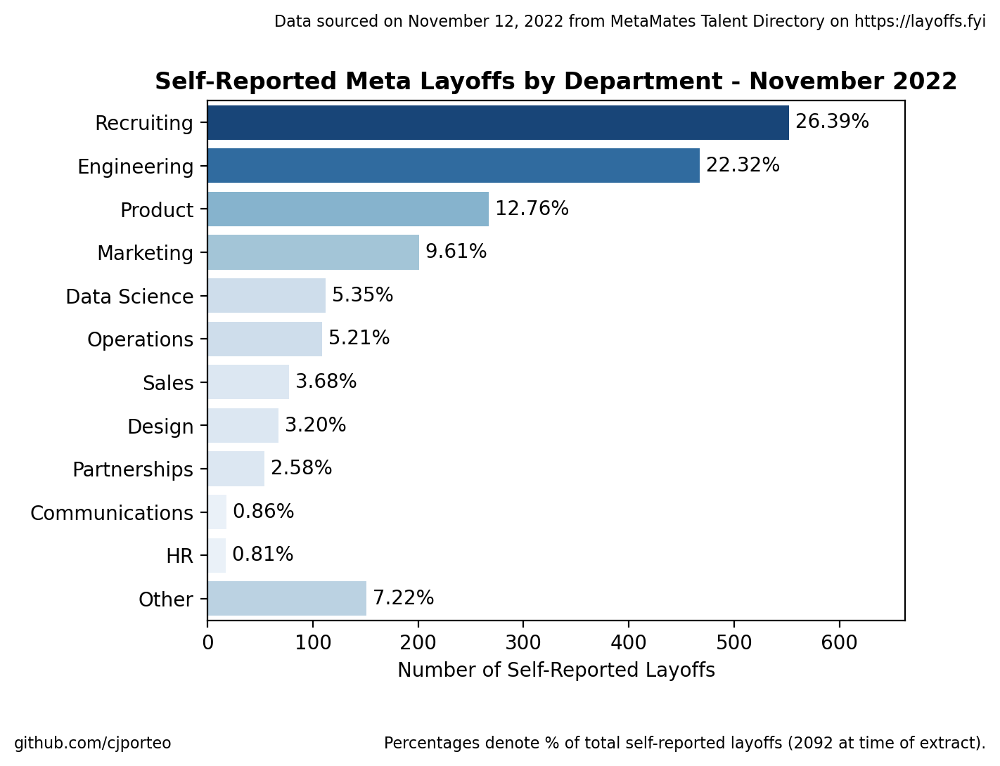
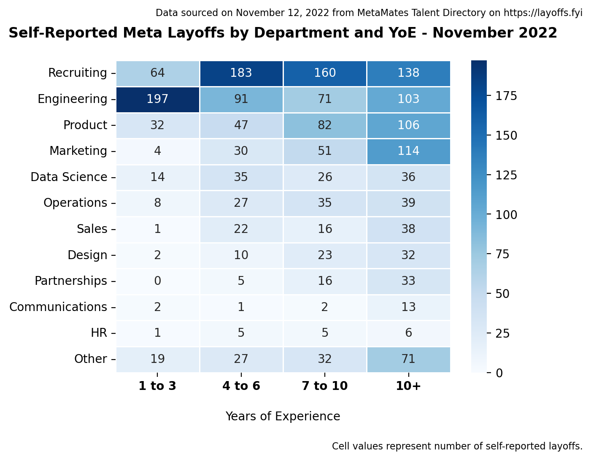
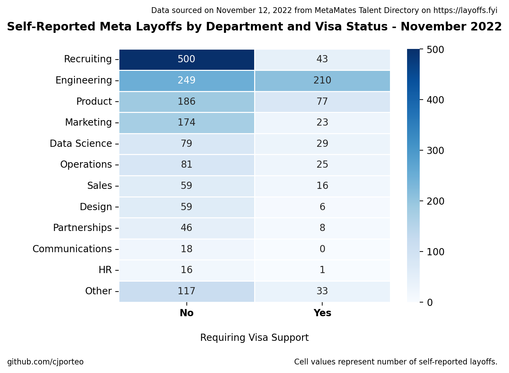

# Meta Layoff Analysis - November 2022
A brief analysis into the November 2022 Meta layoffs, examining which departments were impacted the most.

# Preface

Layoffs are a personal and saddening subject. Each datapoint making up this analysis represents someone who is currently in a tough situation, and I hope that everyone affected can find strength and land on their feet.

For the sake of anonymity of those impacted, I've removed all **PII** (Personal Identifiable Information) in the cleaned dataset that I've pushed to GitHub.

# About

On November 9 2022, Meta announced that it was laying off **11,000 employees**, which translates to ~13% of their total headcount. What wasn't publicized, however, was the distribution of the layoff across different departments. It was speculated that **Recruiting** and **Business** teams were impacted the most, but what do the actual numbers look like? How much was **Engineering** affected? How many juniors were affected compared to seniors?

Following the announcement on Wednesday, a [public self-reporting MetaMates Talent Directory](https://docs.google.com/spreadsheets/d/1edAZoFG25lJpfSpTuJzD9hGijSzRfZ8v84H_Zak4gug) (public Google Sheets file) was created and shared on [layoffs.fyi](https://layoffs.fyi). At time of writing, this dataset contains **over 2000 entries** (nearly 20% of total layoffs, a decent sample to draw from). We can clean and compile this data to help answer some of these questions.

# Findings

# Observations

- **Recruiting** was impacted the most, but **Engineering** isn't too far behind; together, these 2 departments comprise nearly 50% of all self-reported layoffs
- **Engineering** layoffs targeted mainly junior employees, whereas **Product**, **Marketing**, and **Sales** layoffs consisted mainly of senior employees
- The department who will need the most visa support is **Engineering** (46% of laid-off engineers will require visa support)
- Although **Recruiting** makes up the largest percentage of layoffs (26%), only 8% of them will require visa support

# Assumptions

- This analysis assumes minimal selection bias in our sample, which likely isn't true. Some departments might be more/less likely to report their layoffs in the dataset, so our sample probably isn't perfectly representative of the true population (all 11,000 layoffs)
- There is no validation/verification when contributing to this dataset. This is evidenced by "troll" records like "Rahul Ligma" (row 1723) and "Elon Musk" (row 1710). Luckily, datapoints like this are rare and unlikely to skew our insights.

# Environment Installation

To clone repo: 
`git clone https://github.com/cjporteo/meta-layoffs-analysis.git`

To install/activate environment: 
`conda env create -f environment.yml` 
`conda activate meta_layoffs`